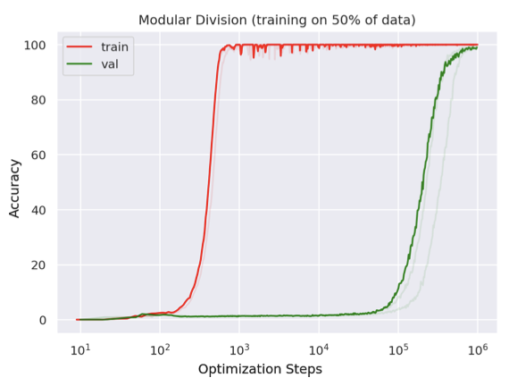
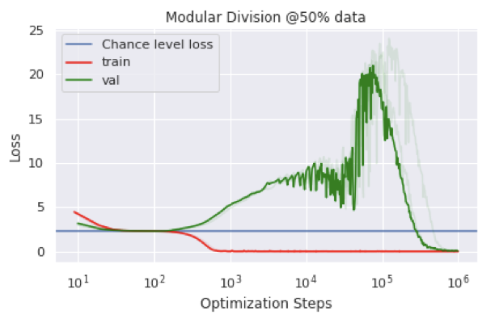
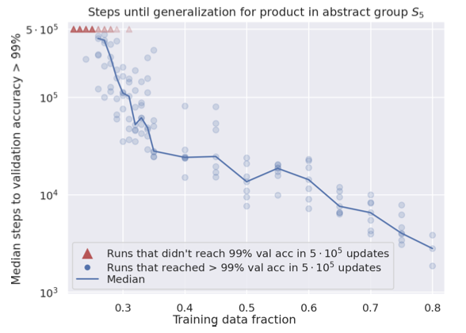
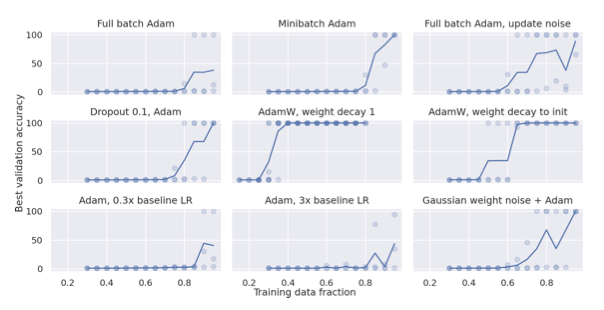
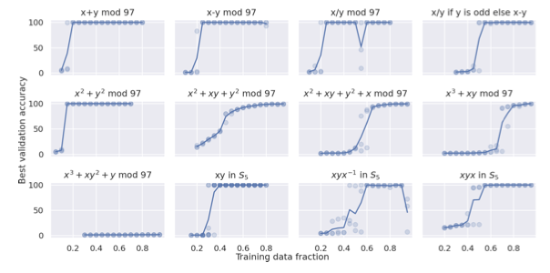

+++
title = "Grokking: Generalization beyond over-fitting on small algorithmic datasets"
date = 2024-03-25
updated = 2024-03-31
draft = false
in_search_index = true

[taxonomies]
  tags = ["llm", "ai", "learning", "open-ai", "Alethea Power", "beginner"]
  categories = ["ai"]
[extra]
math = true
+++

The authors, in the paper [`Grokking: Generalization Beyond Overfitting...`](https://arxiv.org/pdf/2201.02177.pdf)
discusses `generalization` of over-parameterized neural networks like the transformer. They use a small
algorithimically generated dataset for evaluation. You memorize an example when you are repeat what
you saw before. Generalization is about understanding the underlying concept based on the seen
examples, such that it can be applied to unseen data.

With this background, let's dive into the results from the paper.

## Results

Row#|Study|Variables|Fixed|Visualizations From the Paper|Conclusion|
|---|----------|---------|-----|-----------------------------|----------|
|1. | Generalization over optimization steps| accuracy vs optimization steps|<ul><li> Percentage of data used for training (50%)</li><li>Learning a specific operation: binary operation of division mod 97</li></ul>|| - It takes more optimization steps for validation steps to reach the training accuracy. BUT the interesting part is - **it eventually gets there**. The more interesting part is how it gets there which is clear from evidence in row 2.|
|2. |  How the loss changes over the steps of optimization.| Loss vs Optimization steps.| Same as #1||The training and validation get to chance level accuracy. The interesting part is validation errors shoots up as the optimization steps go up until somewhere between $ 10^5 $ and $10^6$ when the magic really happens.|
|3. | How amount of data used for training determines the | Fraction of training data used vs median steps taken to reach the accuracy. | The validation accuracy - 99%   ||Training time required to reach 99% __validation__ accuracy increases rapidly as the training data fraction decreases (Read the graph along decreasing X-axis.)|
|4. |How optimization methods affect generalization ?| % of training data vs validation accuracy. | The optimization step budget: $10^5$ steps.| |Optimization methods affect learning rate and generalization. The good effects of `weight decay` are pronounced.|
|5. |Are there functions that are harder to generalize ?|  % of training data vs validation accuracy.| The optimization step budget: $10^5$ steps.| | It takes larger percentages of training data to generalize functions that are un-symmetrical|

## References
1. https://arxiv.org/pdf/2201.02177.pdf